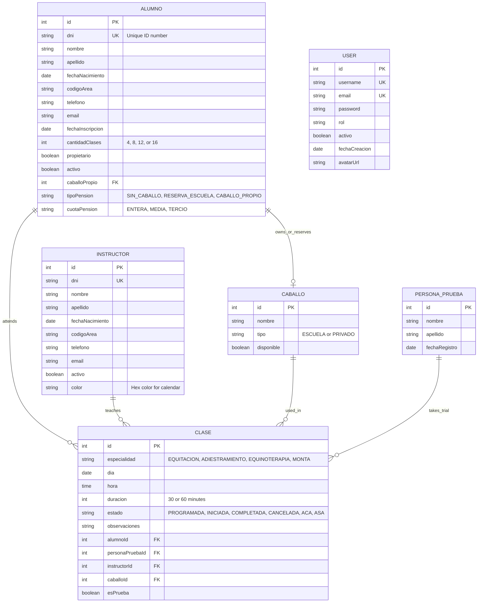

# Data Structure & Relationships

HRS uses a relational data model with well-defined entities and relationships. This page explores the complete data structure, field definitions, and entity relationships.

## Core Entities

The HRS system has five primary entities:

<CardGroup cols={3}>
  <Card title="Alumno" icon="user">
    Students enrolled in the school
  </Card>
  <Card title="Instructor" icon="graduation-cap">
    Teaching staff members
  </Card>
  <Card title="Caballo" icon="horse">
    Horses (school-owned and private)
  </Card>
  <Card title="Clase" icon="notebook-pen">
    Scheduled riding classes
  </Card>
  <Card title="PersonaPrueba" icon="user-graduate">
    Trial class participants
  </Card>
  <Card title="User" icon="shield">
    System users and accounts
  </Card>
</CardGroup>

## Entity Relationship Diagram



## Detailed Entity Definitions

### Alumno (Student)

From `src/lib/api.ts:12`:

```typescript
export interface Alumno {
  id: number;
  dni: string;
  nombre: string;
  apellido: string;
  fechaNacimiento: string;
  codigoArea: string;
  telefono: string;
  email: string;
  fechaInscripcion: string;
  cantidadClases: number;
  propietario: boolean;
  activo: boolean;
  caballoPropio?: number | Caballo;
  tipoPension: TipoPension;
  cuotaPension?: CuotaPension | null;
}
```

<ParamField path="id" type="number" required>
  Primary key - Unique identifier for the student
</ParamField>

<ParamField path="dni" type="string" required>
  **DNI** (Documento Nacional de Identidad)
  - Unique national ID number
  - Numbers only, no punctuation (e.g., "12345678")
  - System validates for duplicates in real-time
  - Acts as a unique constraint in database
</ParamField>

<ParamField path="nombre" type="string" required>
  Student's first name(s)
</ParamField>

<ParamField path="apellido" type="string" required>
  Student's last name(s)
</ParamField>

<ParamField path="fechaNacimiento" type="string" required>
  Birth date in ISO format (YYYY-MM-DD)
  - Used for age calculation
  - Required for insurance purposes
</ParamField>

<ParamField path="codigoArea" type="string" required>
  Area code for phone number
  - Typically "549" for Argentina
</ParamField>

<ParamField path="telefono" type="string" required>
  Phone number without prefix
  - Format: numbers only (e.g., "221234567")
  - System automatically adds +549 prefix
  - Final format: +549221234567
</ParamField>

<ParamField path="email" type="string">
  Email address (optional but recommended)
  - Used for communications
  - Can be used for account creation
</ParamField>

<ParamField path="fechaInscripcion" type="string" required>
  Enrollment date in ISO format
  - Automatically set to current date on creation
  - Tracks when student joined school
</ParamField>

<ParamField path="cantidadClases" type="number" required>
  Monthly lesson plan
  - Valid values: 4, 8, 12, 16
  - Determines student's monthly quota
</ParamField>

<ParamField path="propietario" type="boolean" required>
  Indicates if student owns a horse
  - `true`: Student has private horse
  - `false`: Student uses school horses
</ParamField>

<ParamField path="activo" type="boolean" required>
  Account status
  - `true`: Active student (can book classes)
  - `false`: Inactive (cannot book, but history preserved)
</ParamField>

<ParamField path="caballoPropio" type="number | Caballo">
  Foreign key to assigned/owned horse
  - `null`: No assigned horse
  - `number`: Horse ID reference
  - `Caballo`: Populated horse object in detailed queries
</ParamField>

<ParamField path="tipoPension" type="TipoPension" required>
  Boarding type - one of:
  - `"SIN_CABALLO"`: No assigned horse
  - `"RESERVA_ESCUELA"`: Reserved school horse
  - `"CABALLO_PROPIO"`: Private horse
</ParamField>

<ParamField path="cuotaPension" type="CuotaPension">
  Boarding quota (required if tipoPension is not SIN_CABALLO)
  - `"ENTERA"`: Full boarding
  - `"MEDIA"`: Half boarding
  - `"TERCIO"`: Third boarding
  - `null`: Not applicable (SIN_CABALLO)
</ParamField>

### Instructor

From `src/lib/api.ts:37`:

```typescript
export interface Instructor {
  id: number;
  dni: string;
  nombre: string;
  apellido: string;
  fechaNacimiento: string;
  codigoArea: string;
  telefono: string;
  email: string;
  activo: boolean;
  color: string;
}
```

<ParamField path="id" type="number" required>
  Primary key - Unique instructor identifier
</ParamField>

<ParamField path="dni" type="string" required>
  Unique national ID number (validated for duplicates)
</ParamField>

<ParamField path="nombre" type="string" required>
  Instructor's first name(s)
</ParamField>

<ParamField path="apellido" type="string" required>
  Instructor's last name(s)
</ParamField>

<ParamField path="fechaNacimiento" type="string" required>
  Birth date in ISO format (YYYY-MM-DD)
</ParamField>

<ParamField path="codigoArea" type="string" required>
  Phone area code (e.g., "549")
</ParamField>

<ParamField path="telefono" type="string" required>
  Phone number (system adds +549 prefix)
</ParamField>

<ParamField path="email" type="string">
  Email address (optional)
</ParamField>

<ParamField path="activo" type="boolean" required>
  Employment status
  - `true`: Active instructor (can be assigned classes)
  - `false`: Inactive (history preserved)
</ParamField>

<ParamField path="color" type="string" required>
  Hex color code for calendar identification
  - 7 predefined colors available
  - Used as background in calendar cells
  - Helps visual distinction of classes
  - Example: "#FF6B6B", "#4ECDC4", "#45B7D1"
</ParamField>

### Caballo (Horse)

From `src/lib/api.ts:50`:

```typescript
export interface Caballo {
  id: number;
  nombre: string;
  tipo: TipoCaballo;
  disponible: boolean;
  propietarios?: Alumno[];
}
```

<ParamField path="id" type="number" required>
  Primary key - Unique horse identifier
</ParamField>

<ParamField path="nombre" type="string" required>
  Horse's name
</ParamField>

<ParamField path="tipo" type="TipoCaballo" required>
  Horse ownership type:
  - `"ESCUELA"`: School-owned horse (available to all students)
  - `"PRIVADO"`: Privately-owned horse (only for owner)
  
  From `src/types/enums.ts:15`:
  ```typescript
  export type TipoCaballo = "ESCUELA" | "PRIVADO";
  ```
</ParamField>

<ParamField path="disponible" type="boolean" required>
  Availability status
  - `true`: Can be scheduled for classes
  - `false`: Not available (injured, retired, etc.)
</ParamField>

<ParamField path="propietarios" type="Alumno[]">
  Array of associated students (populated in detailed queries)
  - For PRIVADO: Students who own the horse
  - For ESCUELA: Students who have reserved the horse
</ParamField>

### Clase (Class)

From `src/lib/api.ts:58`:

```typescript
export interface Clase {
  id: number;
  especialidad: EspecialidadClase;
  dia: string;
  hora: string;
  duracion: number;
  estado: EstadoClase;
  observaciones?: string;
  alumnoId: number | null;
  personaPruebaId?: number | null;
  instructorId: number;
  caballoId: number;
  diaHoraCompleto?: string;
  esPrueba?: boolean;
  personaPruebaNombre?: string | null;
  personaPruebaApellido?: string | null;
  personaPruebaNombreCompleto?: string | null;
}
```

<ParamField path="id" type="number" required>
  Primary key - Unique class identifier
</ParamField>

<ParamField path="especialidad" type="EspecialidadClase" required>
  Class specialty type:
  - `"EQUITACION"`: Standard riding lessons
  - `"ADIESTRAMIENTO"`: Dressage/training
  - `"EQUINOTERAPIA"`: Equine therapy
  - `"MONTA"`: Open riding (auto-assigns placeholder student ID 1)
  
  From `src/types/enums.ts:3`:
  ```typescript
  export type EspecialidadClase =
    | "ADIESTRAMIENTO"
    | "EQUINOTERAPIA"
    | "EQUITACION"
    | "MONTA";
  ```
</ParamField>

<ParamField path="dia" type="string" required>
  Class date in ISO format (YYYY-MM-DD)
</ParamField>

<ParamField path="hora" type="string" required>
  Start time in 24-hour format (HH:mm)
  - Example: "09:00", "14:30", "18:00"
  - Must be on 30-minute intervals
</ParamField>

<ParamField path="duracion" type="number" required>
  Duration in minutes
  - Valid values: 30, 60
  - Default: 30
  - 60-minute classes occupy two time slots
</ParamField>

<ParamField path="estado" type="EstadoClase" required>
  Class state:
  - `"PROGRAMADA"`: Scheduled (default for new classes)
  - `"INICIADA"`: Started/in progress
  - `"COMPLETADA"`: Successfully completed
  - `"CANCELADA"`: Cancelled
  - `"ACA"`: Absence with Advance Notice
  - `"ASA"`: Absence without Advance Notice
  
  From `src/types/enums.ts:8`:
  ```typescript
  export type EstadoClase =
    | "PROGRAMADA"
    | "INICIADA"
    | "COMPLETADA"
    | "CANCELADA"
    | "ACA"
    | "ASA";
  ```
</ParamField>

<ParamField path="observaciones" type="string">
  Optional notes/comments about the class
</ParamField>

<ParamField path="alumnoId" type="number | null" required>
  Foreign key to Alumno
  - `null`: For trial classes with PersonaPrueba
  - `number`: Student ID for regular classes
  - For MONTA specialty: ID 1 (placeholder student)
</ParamField>

<ParamField path="personaPruebaId" type="number | null">
  Foreign key to PersonaPrueba
  - `null`: Regular class with enrolled student
  - `number`: Trial class for prospective student
</ParamField>

<ParamField path="instructorId" type="number" required>
  Foreign key to Instructor (always required)
</ParamField>

<ParamField path="caballoId" type="number" required>
  Foreign key to Caballo (always required)
</ParamField>

<ParamField path="diaHoraCompleto" type="string">
  Combined date-time string (computed field)
</ParamField>

<ParamField path="esPrueba" type="boolean">
  Trial class flag
  - `true`: This is a trial/demo class
  - `false` or `undefined`: Regular class
</ParamField>

<ParamField path="personaPruebaNombre" type="string | null">
  First name of trial person (if trial class)
</ParamField>

<ParamField path="personaPruebaApellido" type="string | null">
  Last name of trial person (if trial class)
</ParamField>

<ParamField path="personaPruebaNombreCompleto" type="string | null">
  Full name of trial person (computed field)
</ParamField>

### ClaseDetallada (Detailed Class)

From `src/lib/api.ts:77`:

```typescript
export interface ClaseDetallada extends Clase {
  alumno?: Alumno;
  personaPrueba?: PersonaPrueba;
  instructor?: Instructor;
  caballo?: Caballo;
  esPrueba?: boolean;
}
```

Extends `Clase` with populated relationships:
- **alumno**: Full Alumno object (if not trial class)
- **personaPrueba**: Full PersonaPrueba object (if trial class)
- **instructor**: Full Instructor object
- **caballo**: Full Caballo object

Used in detailed views and calendar to avoid multiple API calls.

### PersonaPrueba (Trial Person)

From `src/lib/api.ts:30`:

```typescript
export interface PersonaPrueba {
  id: number;
  nombre: string;
  apellido: string;
  fechaRegistro: string;
}
```

<ParamField path="id" type="number" required>
  Primary key - Unique identifier
</ParamField>

<ParamField path="nombre" type="string" required>
  First name of trial participant
</ParamField>

<ParamField path="apellido" type="string" required>
  Last name of trial participant
</ParamField>

<ParamField path="fechaRegistro" type="string" required>
  Registration date (ISO format)
  - Automatically set to current date
</ParamField>

### User

From `src/services/authService.ts:5`:

```typescript
export interface User {
  id: number;
  username: string;
  email: string;
  password: string;
  rol?: string;
  activo: boolean;
  fechaCreacion: string;
  avatarUrl?: string;
}
```

<ParamField path="id" type="number" required>
  Primary key - Unique user identifier
</ParamField>

<ParamField path="username" type="string" required>
  Unique username for login (unique constraint)
</ParamField>

<ParamField path="email" type="string" required>
  Email address (unique constraint, must be in whitelist)
</ParamField>

<ParamField path="password" type="string" required>
  Hashed password (never sent to client)
</ParamField>

<ParamField path="rol" type="string">
  User role (e.g., "admin", "instructor", "receptionist")
</ParamField>

<ParamField path="activo" type="boolean" required>
  Account active status
</ParamField>

<ParamField path="fechaCreacion" type="string" required>
  Account creation date (ISO format)
</ParamField>

<ParamField path="avatarUrl" type="string">
  URL to user's profile picture
</ParamField>

## Type Enums

From `src/types/enums.ts`:

```typescript
export type TipoPension = "SIN_CABALLO" | "RESERVA_ESCUELA" | "CABALLO_PROPIO";
export type CuotaPension = "ENTERA" | "MEDIA" | "TERCIO";
export type EspecialidadClase = "ADIESTRAMIENTO" | "EQUINOTERAPIA" | "EQUITACION" | "MONTA";
export type EstadoClase = "PROGRAMADA" | "INICIADA" | "COMPLETADA" | "CANCELADA" | "ACA" | "ASA";
export type TipoCaballo = "ESCUELA" | "PRIVADO";
```

## Relationships

### One-to-Many Relationships

<Accordion title="Alumno → Clase">
  **One student can have many classes**
  
  ```typescript
  // From Clase entity
  alumnoId: number | null; // FK to Alumno.id
  ```
  
  - A student can be enrolled in multiple classes
  - Each class has exactly one student (or PersonaPrueba)
  - Student can be deleted if they have no classes
  - Cascade: Typically preserve classes when student becomes inactive
</Accordion>

<Accordion title="Instructor → Clase">
  **One instructor can teach many classes**
  
  ```typescript
  // From Clase entity
  instructorId: number; // FK to Instructor.id (required)
  ```
  
  - An instructor teaches multiple classes
  - Each class must have exactly one instructor
  - Cannot delete instructor with scheduled classes
  - Cascade: Typically prevent deletion or reassign classes
</Accordion>

<Accordion title="Caballo → Clase">
  **One horse can be used in many classes**
  
  ```typescript
  // From Clase entity
  caballoId: number; // FK to Caballo.id (required)
  ```
  
  - A horse can be scheduled for multiple classes
  - Each class uses exactly one horse
  - Cannot delete horse with scheduled classes
  - Cascade: Prevent deletion or mark unavailable
</Accordion>

<Accordion title="PersonaPrueba → Clase">
  **One trial person can have multiple trial classes**
  
  ```typescript
  // From Clase entity
  personaPruebaId?: number | null; // FK to PersonaPrueba.id
  ```
  
  - Trial participants can try different specialties
  - System validates no duplicate trials per specialty
  - Trial classes marked with `esPrueba: true`
</Accordion>

### One-to-One or Many-to-One Relationships

<Accordion title="Alumno → Caballo (Owner/Reservation)">
  **Student can own/reserve one horse**
  
  ```typescript
  // From Alumno entity
  caballoPropio?: number | Caballo; // FK to Caballo.id
  tipoPension: TipoPension;
  ```
  
  **Scenarios:**
  
  1. **SIN_CABALLO**: `caballoPropio = null`
     - No assigned horse
     - School assigns available horse per class
  
  2. **RESERVA_ESCUELA**: `caballoPropio = ID of ESCUELA horse`
     - Student reserves specific school horse
     - Horse type must be "ESCUELA"
     - Other students can still use if not reserved
  
  3. **CABALLO_PROPIO**: `caballoPropio = ID of PRIVADO horse`
     - Student owns the horse
     - Horse type must be "PRIVADO"
     - Only owner can use this horse
</Accordion>

<Accordion title="Caballo → Alumno (Owners)">
  **Horse can have multiple owner associations**
  
  ```typescript
  // From Caballo entity (populated)
  propietarios?: Alumno[];
  ```
  
  - **PRIVADO horses**: Usually one owner
  - **ESCUELA horses**: Can have multiple students with reservations
  - Reverse relationship of Alumno.caballoPropio
</Accordion>

## Search Filter Interfaces

From `src/lib/api.ts:85`:

### AlumnoSearchFilters

```typescript
export interface AlumnoSearchFilters {
  dni?: string;
  nombre?: string;
  apellido?: string;
  activo?: boolean;
  propietario?: boolean;
  fechaInscripcion?: string;
  fechaNacimiento?: string;
}
```

### InstructorSearchFilters

```typescript
export interface InstructorSearchFilters {
  nombre?: string;
  apellido?: string;
  activo?: boolean;
  fechaNacimiento?: string;
}
```

### CaballoSearchFilters

```typescript
export interface CaballoSearchFilters {
  nombre?: string;
  tipo?: TipoCaballo;
  disponible?: boolean;
  propietarios?: Alumno[];
}
```

### ClaseSearchFilters

```typescript
export interface ClaseSearchFilters {
  dia?: string;
  hora?: string;
  alumnoId?: number;
  instructorId?: number;
  caballoId?: number;
  especialidad?: EspecialidadClase;
  estado?: EstadoClase;
}
```

## Data Validation Rules

### Business Rules

<Warning>
  **Critical Validations Enforced:**
  
  1. **Unique DNI**: No duplicate DNIs for students or instructors
  2. **Time Constraints**: Classes cannot end after 18:30
  3. **Scheduling Conflicts**: No overlapping classes for same horse or instructor
  4. **Private Horse Access**: PRIVADO horses only usable by owner
  5. **Trial Class Rules**: Complex validation for trial eligibility
  6. **State Transitions**: Cannot edit COMPLETADA, INICIADA, or CANCELADA classes
  7. **Duration Values**: Only 30 or 60 minutes allowed
  8. **Lesson Plans**: Only 4, 8, 12, or 16 classes per month
</Warning>

### Field Constraints

**Phone Numbers:**
- Input format: Numbers only (e.g., "221234567")
- System adds: "+549" prefix
- Final format: "+549221234567"

**Dates:**
- Format: ISO 8601 (YYYY-MM-DD)
- Examples: "2026-03-04", "2025-12-31"

**Times:**
- Format: 24-hour (HH:mm)
- Must be on 30-minute intervals
- Range: 09:00 to 18:30
- Examples: "09:00", "14:30", "18:00"

**Enum Values:**
- Must exactly match defined enum values
- Case-sensitive
- No custom values allowed

## API Response Formats

### Success Response

```typescript
// Single entity
{
  id: 1,
  nombre: "Juan",
  apellido: "Pérez",
  // ... other fields
}

// Array of entities
[
  { id: 1, nombre: "Juan", ... },
  { id: 2, nombre: "María", ... }
]

// With success message
{
  id: 1,
  nombre: "Juan",
  __successMessage: "Alumno creado exitosamente"
}
```

### Error Response

From `src/lib/api.ts:128`:

```typescript
export interface ApiErrorResponse {
  timestamp: string;      // "2026-03-04T10:30:00Z"
  status: number;         // 400, 404, 500, etc.
  error: string;          // "Bad Request"
  mensaje: string;        // "El DNI ya existe"
  path: string;           // "/api/alumnos"
  errores?: Record<string, string>; // Field-specific errors
}

// Example error response:
{
  "timestamp": "2026-03-04T10:30:00Z",
  "status": 400,
  "error": "Bad Request",
  "mensaje": "Error de validación",
  "path": "/api/alumnos",
  "errores": {
    "dni": "El DNI ya existe en el sistema",
    "telefono": "El teléfono debe tener al menos 9 dígitos"
  }
}
```

## Data Flow Examples

### Creating a Student with Private Horse

<Steps>
  <Step title="Create Horse First">
    ```typescript
    const horse = await caballosApi.crear({
      nombre: "Thunder",
      tipo: "PRIVADO",
      disponible: true
    });
    // Returns: { id: 10, nombre: "Thunder", tipo: "PRIVADO", disponible: true }
    ```
  </Step>
  
  <Step title="Create Student with Horse Reference">
    ```typescript
    const student = await alumnosApi.crear({
      dni: "12345678",
      nombre: "María",
      apellido: "González",
      fechaNacimiento: "1990-05-15",
      codigoArea: "549",
      telefono: "221234567",
      email: "maria@example.com",
      fechaInscripcion: "2026-03-04",
      cantidadClases: 12,
      propietario: true,
      activo: true,
      caballoPropio: 10, // horse.id
      tipoPension: "CABALLO_PROPIO",
      cuotaPension: "ENTERA"
    });
    ```
  </Step>
  
  <Step title="System Links Entities">
    - Student's `caballoPropio` set to horse ID
    - Horse's `propietarios` array includes student
    - Both entities saved in database
  </Step>
</Steps>

### Scheduling a Class

<Steps>
  <Step title="Create Class">
    ```typescript
    const clase = await clasesApi.crear({
      especialidad: "EQUITACION",
      dia: "2026-03-10",
      hora: "10:00",
      duracion: 60,
      estado: "PROGRAMADA",
      alumnoId: 5,
      instructorId: 2,
      caballoId: 8,
      observaciones: "Primera clase del mes"
    });
    ```
  </Step>
  
  <Step title="Fetch Detailed Class">
    ```typescript
    const detailed = await clasesApi.obtenerDetallada(clase.id);
    // Returns ClaseDetallada with populated alumno, instructor, caballo objects
    ```
  </Step>
</Steps>

---

Understanding the data structure is essential for effectively using and extending the HRS system. All relationships are carefully designed to maintain data integrity while providing flexibility for various school scenarios.