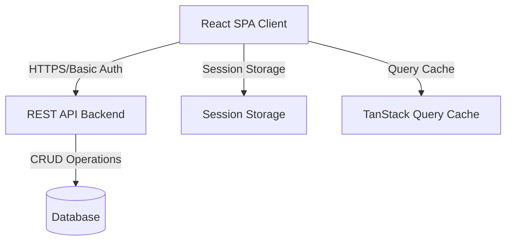
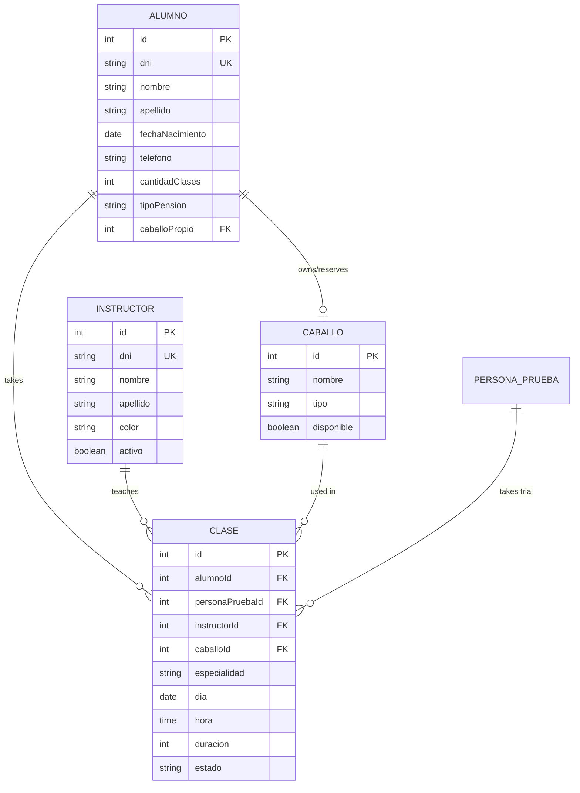

# System Architecture & Overview

HRS is built with modern web technologies following a client-server architecture with RESTful API communication. This page explores the system's technical design and structure.

## Architecture Overview



### High-Level Architecture

<CardGroup cols={2}>
  <Card title="Frontend (Client)" icon="browser">
    React 18 Single Page Application
    - TypeScript for type safety
    - Vite for fast builds
    - TailwindCSS for styling
    - Radix UI components
  </Card>
  
  <Card title="Backend (API)" icon="server">
    RESTful API Server
    - Basic Authentication
    - JSON data format
    - CORS enabled
    - Validation layer
  </Card>
  
  <Card title="State Management" icon="database">
    Hybrid approach
    - TanStack Query for server state
    - React Context for auth state
    - Session storage for credentials
  </Card>
  
  <Card title="Data Layer" icon="table">
    Relational Database
    - Students, Instructors, Horses
    - Classes with relationships
    - User accounts
  </Card>
</CardGroup>

## Technology Stack

### Frontend Technologies

From `package.json:1`:

```json
{
  "name": "vite_react_shadcn_ts",
  "type": "module",
  "dependencies": {
    "react": "^18.3.1",
    "react-dom": "^18.3.1",
    "react-router-dom": "^6.30.1",
    "@tanstack/react-query": "^5.83.0",
    "typescript": "^5.8.3"
  }
}
```

<Tabs>
  <Tab title="Core Framework">
    **React 18.3.1**
    - Modern React with Hooks
    - Concurrent rendering
    - Automatic batching
    - Suspense support
    
    **TypeScript 5.8.3**
    - Strong typing throughout
    - Interface definitions for all entities
    - Type-safe API calls
    - Enhanced IDE support
  </Tab>
  
  <Tab title="Build Tools">
    **Vite 6.4.1**
    - Lightning-fast HMR
    - Optimized production builds
    - Native ES modules
    - Plugin ecosystem
    
    From `package.json:7`:
    ```json
    "scripts": {
      "dev": "vite",
      "build": "vite build",
      "preview": "vite preview"
    }
    ```
  </Tab>
  
  <Tab title="Routing & State">
    **React Router DOM 6.30.1**
    - Client-side routing
    - Protected routes
    - Nested routes
    - Navigation guards
    
    **TanStack Query 5.83.0**
    - Server state management
    - Automatic caching
    - Background refetching
    - Optimistic updates
  </Tab>
  
  <Tab title="UI & Styling">
    **TailwindCSS 3.4.17**
    - Utility-first CSS
    - Responsive design
    - Custom theme
    - JIT compilation
    
    **Radix UI**
    - Accessible components
    - Unstyled primitives
    - Keyboard navigation
    - ARIA compliant
    
    **shadcn/ui**
    - Pre-built components
    - Customizable design system
    - Copy-paste components
  </Tab>
</Tabs>

### Key Libraries

From `package.json:45`:

```json
{
  "date-fns": "^3.6.0",
  "exceljs": "^4.4.0",
  "file-saver": "^2.0.5",
  "recharts": "^2.15.4",
  "react-hook-form": "^7.61.1",
  "zod": "^3.25.76"
}
```

<CardGroup cols={2}>
  <Card title="date-fns" icon="calendar">
    Modern date utility library
    - Date formatting and parsing
    - Time calculations
    - Locale support
    - Lightweight and modular
  </Card>
  
  <Card title="ExcelJS" icon="file-excel">
    Professional Excel generation
    - Advanced formatting
    - Cell styling and colors
    - Comments and formulas
    - A4 print optimization
  </Card>
  
  <Card title="Recharts" icon="chart-line">
    Data visualization
    - Bar charts for distributions
    - Line charts for trends
    - Pie charts for percentages
    - Responsive and customizable
  </Card>
  
  <Card title="Zod" icon="shield">
    Schema validation
    - Runtime type checking
    - Form validation
    - API response validation
    - TypeScript integration
  </Card>
</CardGroup>

## Application Structure

### Project Organization

```
src/
├── components/          # React components
│   ├── auth/           # Authentication components
│   ├── calendar/       # Calendar views
│   ├── cards/          # Card components
│   ├── forms/          # Form components
│   └── ui/             # UI primitives (shadcn)
├── contexts/           # React contexts
│   └── AuthProvider    # Authentication context
├── hooks/              # Custom React hooks
│   ├── useCalendar     # Calendar logic
│   ├── useReportes     # Report generation
│   └── useValidar...   # Validation hooks
├── lib/                # Utilities and libraries
│   └── api.ts          # API client
├── pages/              # Route pages
│   ├── Index           # Dashboard
│   ├── Alumnos         # Students
│   ├── Instructores    # Instructors
│   ├── Caballos        # Horses
│   ├── Clases          # Classes
│   ├── Calendario      # Calendar
│   ├── Reportes        # Reports
│   └── Finanzas        # Finances
├── services/           # External services
│   └── authService     # Auth service
├── types/              # TypeScript types
│   └── enums.ts        # Enums and types
└── utils/              # Utility functions
```

### Routing Architecture

From `src/App.tsx:30`:

```typescript
const App = () => (
  <QueryClientProvider client={queryClient}>
    <AuthProvider>
      <TooltipProvider>
        <Toaster />
        <Sonner />
        <BrowserRouter>
          <IdleHandler />
          <Routes>
            <Route path="/login" element={<Login />} />
            <Route path="/register" element={<Register />} />
            <Route
              path="/"
              element={
                <ProtectedRoute>
                  <Index />
                </ProtectedRoute>
              }
            />
            {/* ... more protected routes */}
          </Routes>
        </BrowserRouter>
      </TooltipProvider>
    </AuthProvider>
  </QueryClientProvider>
);
```

**Key Features:**
- Protected route wrapper for authentication
- Nested provider architecture
- Global notification systems (Toaster, Sonner)
- Idle timeout handler
- 404 catch-all route

## API Architecture

### RESTful API Design

From `src/lib/api.ts:9`:

```typescript
const API_BASE_URL = import.meta.env.VITE_API_BASE_URL;

async function apiFetch(endpoint: string, options: RequestInit = {}) {
  const credentials = sessionStorage.getItem("authCredentials");
  
  const headers: Record<string, string> = {
    "Content-Type": "application/json",
    ...(options.headers as Record<string, string>),
  };
  
  if (credentials) {
    headers["Authorization"] = `Basic ${credentials}`;
  }
  
  return fetch(`${API_BASE_URL}${endpoint}`, {
    ...options,
    headers,
  });
}
```

### API Endpoints

<Accordion>
  <AccordionItem title="Students API (Alumnos)">
    ```typescript
    export const alumnosApi = {
      listar: async (): Promise<Alumno[]>
      obtener: async (id: number): Promise<Alumno>
      crear: async (alumno: Omit<Alumno, "id">): Promise<Alumno>
      actualizar: async (id: number, alumno: Partial<Alumno>): Promise<Alumno>
      eliminar: async (id: number): Promise<void>
      buscar: async (filters: AlumnoSearchFilters): Promise<Alumno[]>
    }
    ```
    
    **Endpoints:**
    - `GET /alumnos` - List all students
    - `GET /alumnos/{id}` - Get student by ID
    - `POST /alumnos` - Create new student
    - `PUT /alumnos/{id}` - Update student
    - `DELETE /alumnos/{id}` - Delete student
    - `GET /alumnos/buscar?{params}` - Search students
  </AccordionItem>
  
  <AccordionItem title="Instructors API">
    ```typescript
    export const instructoresApi = {
      listar: async (): Promise<Instructor[]>
      obtener: async (id: number): Promise<Instructor>
      crear: async (instructor: Omit<Instructor, "id">): Promise<Instructor>
      actualizar: async (id: number, instructor: Partial<Instructor>): Promise<Instructor>
      eliminar: async (id: number): Promise<void>
      buscar: async (filters: InstructorSearchFilters): Promise<Instructor[]>
    }
    ```
    
    Similar CRUD operations for instructors.
  </AccordionItem>
  
  <AccordionItem title="Horses API (Caballos)">
    ```typescript
    export const caballosApi = {
      listar: async (): Promise<Caballo[]>
      obtener: async (id: number): Promise<Caballo>
      crear: async (caballo: Omit<Caballo, "id">): Promise<Caballo>
      actualizar: async (id: number, caballo: Partial<Caballo>): Promise<Caballo>
      eliminar: async (id: number): Promise<void>
      buscar: async (filters: CaballoSearchFilters): Promise<Caballo[]>
    }
    ```
    
    CRUD operations plus owner associations.
  </AccordionItem>
  
  <AccordionItem title="Classes API (Clases)">
    ```typescript
    export const clasesApi = {
      listar: async (): Promise<Clase[]>
      listarDetalladas: async (): Promise<ClaseDetallada[]>
      obtener: async (id: number): Promise<Clase>
      obtenerDetallada: async (id: number): Promise<ClaseDetallada>
      crear: async (clase: Omit<Clase, "id">): Promise<Clase>
      actualizar: async (id: number, clase: Partial<Clase>): Promise<Clase>
      eliminar: async (id: number): Promise<void>
      buscar: async (filters: ClaseSearchFilters): Promise<Clase[]>
      buscarPorAlumno: async (alumnoId: number): Promise<Clase[]>
      buscarPorInstructor: async (instructorId: number): Promise<Clase[]>
      buscarPorCaballo: async (caballoId: number): Promise<Clase[]>
      cambiarEstado: async (id: number, estado: EstadoClase, obs: string): Promise<Clase>
      copiarClases: async (payload: unknown): Promise<unknown>
      eliminarClases: async (payload: unknown): Promise<unknown>
    }
    ```
    
    **Special Endpoints:**
    - `GET /clases/detalles` - Classes with populated relationships
    - `GET /clases/{id}/detalles` - Single class with relationships
    - `GET /clases/alumno/{id}/detalles` - Classes for student
    - `GET /clases/instructor/{id}/detalles` - Classes for instructor
    - `GET /clases/caballo/{id}/detalles` - Classes for horse
    - `PATCH /clases/{id}/estado` - Update class state
    - `POST /calendario/copiar-clases` - Copy classes
    - `DELETE /calendario/eliminar-clases` - Bulk delete
  </AccordionItem>
  
  <AccordionItem title="Trial Persons API">
    ```typescript
    export const personasPruebaApi = {
      crear: async (data: {nombre: string; apellido: string}): Promise<PersonaPrueba>
      listar: async (): Promise<PersonaPrueba[]>
    }
    ```
    
    Manages trial class participants who aren't registered students.
  </AccordionItem>
</Accordion>

### Error Handling

From `src/lib/api.ts:157`:

```typescript
async function handleResponse<T>(response: Response): Promise<T> {
  if (response.status === 401) {
    sessionStorage.removeItem("authCredentials");
    sessionStorage.removeItem("user");
    window.location.href = "/login";
    throw new Error("Sesión no autorizada");
  }
  
  if (!response.ok) {
    const errorData: ApiErrorResponse = await response.json().catch(() => ({}));
    
    // Validation errors
    if (errorData.errores) {
      const mensajesValidacion = Object.values(errorData.errores).join(". ");
      throw new Error(mensajesValidacion);
    }
    
    // General error message
    const errorMessage =
      errorData.mensaje || errorData.error || `Error ${response.status}`;
    throw new Error(errorMessage);
  }
  
  return response.json();
}
```

**Error Response Format:**

```typescript
export interface ApiErrorResponse {
  timestamp: string;
  status: number;
  error: string;
  mensaje: string;
  path: string;
  errores?: Record<string, string>;
}
```

## Authentication System

### Basic Auth Implementation

From `src/services/authService.ts:54`:

```typescript
export const encodeCredentials = (
  username: string,
  password: string,
): string => {
  return btoa(`${username}:${password}`);
};

export const storeCredentials = (credentials: string, user: User): void => {
  sessionStorage.setItem("authCredentials", credentials);
  const { password, ...safeUser } = user;
  sessionStorage.setItem("user", JSON.stringify(safeUser));
};
```

### User Model

From `src/services/authService.ts:5`:

```typescript
export interface User {
  id: number;
  username: string;
  email: string;
  password: string;
  rol?: string;
  activo: boolean;
  fechaCreacion: string;
  avatarUrl?: string;
}

export type SafeUser = Omit<User, "password">;
```

### Protected Routes

From `src/components/auth/ProtectedRoute.tsx`:

```typescript
const ProtectedRoute = ({ children }: { children: React.ReactNode }) => {
  const credentials = sessionStorage.getItem("authCredentials");
  
  if (!credentials) {
    return <Navigate to="/login" replace />;
  }
  
  return <>{children}</>;
};
```

### Idle Timeout

From `src/components/auth/IdleHandler.tsx`:

- 15-minute inactivity timeout
- Automatic logout
- Activity tracking (mouse, keyboard, touch)
- Warning before logout

## State Management Strategy

### Server State (TanStack Query)

```typescript
const queryClient = new QueryClient();

function App() {
  return (
    <QueryClientProvider client={queryClient}>
      {/* app */}
    </QueryClientProvider>
  );
}
```

**Used for:**
- API data fetching
- Caching API responses
- Automatic refetching
- Optimistic updates
- Loading and error states

### Client State (React Context)

From `src/contexts/AuthProvider.tsx`:

```typescript
interface AuthContextType {
  user: SafeUser | null;
  login: (credentials: LoginCredentials) => Promise<void>;
  logout: () => Promise<void>;
  isAuthenticated: boolean;
}

const AuthContext = createContext<AuthContextType | undefined>(undefined);
```

**Used for:**
- Authentication state
- Current user information
- Login/logout actions
- Session management

### Local Storage Strategy

**Session Storage** (temporary, cleared on tab close):
- `authCredentials` - Encoded Basic Auth
- `user` - Current user data (without password)

**Local Storage** (persistent):
- Not used for sensitive data
- Could be used for user preferences

## Data Model & Relationships

### Entity Relationship Diagram



### Type Definitions

From `src/types/enums.ts`:

```typescript
export type TipoPension = "SIN_CABALLO" | "RESERVA_ESCUELA" | "CABALLO_PROPIO";
export type CuotaPension = "ENTERA" | "MEDIA" | "TERCIO";
export type EspecialidadClase = "ADIESTRAMIENTO" | "EQUINOTERAPIA" | "EQUITACION" | "MONTA";
export type EstadoClase = "PROGRAMADA" | "INICIADA" | "COMPLETADA" | "CANCELADA" | "ACA" | "ASA";
export type TipoCaballo = "ESCUELA" | "PRIVADO";
```

## Performance Optimizations

<CardGroup cols={2}>
  <Card title="Code Splitting" icon="scissors">
    - Route-based code splitting
    - Lazy loading components
    - Reduced initial bundle size
    - Faster first paint
  </Card>
  
  <Card title="Query Caching" icon="database">
    - TanStack Query automatic caching
    - Stale-while-revalidate strategy
    - Background refetching
    - Reduced API calls
  </Card>
  
  <Card title="Build Optimization" icon="zap">
    - Vite's optimized builds
    - Tree shaking
    - Minification
    - Asset optimization
  </Card>
  
  <Card title="Responsive Design" icon="mobile">
    - Mobile-first approach
    - Responsive layouts
    - Touch-friendly interfaces
    - Adaptive components
  </Card>
</CardGroup>

## Security Considerations

<Warning>
  **Security Measures Implemented:**
  
  1. **Authentication**: Basic Auth over HTTPS
  2. **Session Management**: Auto-logout after 15 minutes
  3. **Credentials Storage**: Session storage (cleared on close)
  4. **Protected Routes**: Authentication required
  5. **Input Validation**: Client and server-side validation
  6. **CORS**: Proper CORS configuration
  7. **No Password Storage**: Passwords never stored in browser
</Warning>

## Deployment Architecture

```bash
# Development
npm run dev          # Vite dev server with HMR

# Production Build
npm run build        # Optimized production build
npm run preview      # Preview production build locally
```

**Build Output:**
- Minified JavaScript bundles
- Optimized CSS
- Asset hashing for cache busting
- Source maps for debugging

---

This architecture provides a solid foundation for a scalable, maintainable equestrian school management system with modern development practices and excellent user experience.