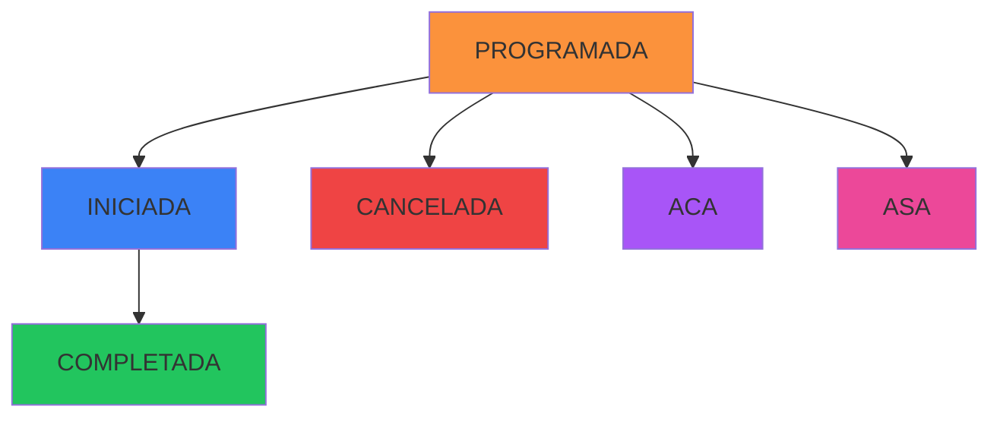

## Overview

Classes move through different states during their lifecycle, from initial scheduling to completion or cancellation. Each state has specific colors, labels, and business rules.

## State Enum

<CodeGroup>
```typescript enums.ts
export type EstadoClase =
  | "PROGRAMADA"
  | "INICIADA"
  | "COMPLETADA"
  | "CANCELADA"
  | "ACA"
  | "ASA";
```
</CodeGroup>

See: `~/workspace/source/src/types/enums.ts:8-14`

## State Definitions

### 1. PROGRAMADA (Scheduled)

<Card title="Programada" icon="calendar" color="#fb923c">
  Class is scheduled and awaiting the start time
</Card>

**Color**: Orange (🟠)  
**Default**: All new classes start in this state  
**Editable**: Yes

#### Characteristics

- Initial state for all created classes
- Class is scheduled but hasn't started yet
- Can be edited or deleted
- Counts toward student's monthly quota

```tsx ClaseForm.tsx
const [estado, setEstado] = useState<Clase["estado"]>("PROGRAMADA");
```

See: `~/workspace/source/src/components/forms/ClaseForm.tsx:86`

### 2. INICIADA (Started)

<Card title="Iniciada" icon="play" color="#3b82f6">
  Class is currently in progress
</Card>

**Color**: Blue (🔵)  
**Editable**: No

#### Characteristics

- Class has started but not yet completed
- Cannot be edited or deleted
- Indicates active session
- Typically short-lived state

<Warning>
  Once a class reaches INICIADA state, it can no longer be edited or deleted.
</Warning>

### 3. COMPLETADA (Completed)

<Card title="Completada" icon="check" color="#22c55e">
  Class was successfully completed
</Card>

**Color**: Green (🟢)  
**Editable**: No

#### Characteristics

- Class finished successfully
- Student attended and completed the lesson
- Cannot be edited or deleted (historical record)
- Counts toward student's attendance statistics
- Counts toward instructor's completed classes

### 4. CANCELADA (Cancelled)

<Card title="Cancelada" icon="ban" color="#ef4444">
  Class was cancelled
</Card>

**Color**: Red (🔴)  
**Editable**: No

#### Characteristics

- Class was cancelled for various reasons
- Cannot be edited or deleted
- Does not count toward student's quota
- Preserved for historical records

#### Cancellation Reasons

From the README, when cancelling a full day:
> Permite seleccionar motivo:
> - Lluvia
> - Feriado
> - Mantenimiento
> - Evento Especial
> - Emergencia
> - Otro (con observaciones personalizadas)

See: `~/workspace/source/README.md:311-317`

### 5. ACA (Absence with Notice)

<Card title="ACA - Ausencia Con Aviso" icon="phone" color="#a855f7">
  Student notified they would not attend
</Card>

**Color**: Purple (🟣)  
**Editable**: No

#### Characteristics

- Student provided advance notice of absence
- More favorable than ASA (unexcused absence)
- May or may not count toward quota depending on school policy
- Shows student courtesy and communication

### 6. ASA (Absence without Notice)

<Card title="ASA - Ausencia Sin Aviso" icon="user-xmark" color="#ec4899">
  Student did not attend without notice
</Card>

**Color**: Pink/Rose (🌸)  
**Editable**: No

#### Characteristics

- Student did not show up and didn't notify
- Unexcused absence
- May have policy implications
- Typically counts against student quota
- May affect student standing

## State Colors and Labels

The system uses consistent color coding throughout:

```tsx constants
const ESTADO_COLORS = {
  PROGRAMADA: "warning",
  INICIADA: "info",
  COMPLETADA: "success",
  CANCELADA: "destructive",
  ACA: "purple",
  ASA: "pink",
};

const ESTADO_LABELS = {
  PROGRAMADA: "Programada",
  INICIADA: "Iniciada",
  COMPLETADA: "Completada",
  CANCELADA: "Cancelada",
  ACA: "ACA",
  ASA: "ASA",
};
```

From the README:
> - **Borde izquierdo**: Color según estado de la clase:
>   - 🟠 Naranja: PROGRAMADA
>   - 🔵 Azul: INICIADA
>   - 🟢 Verde: COMPLETADA
>   - 🔴 Rojo: CANCELADA
>   - 🟣 Púrpura: ACA (Ausencia con Aviso)
>   - 🌸 Rosa: ASA (Ausencia sin Aviso)

See: `~/workspace/source/README.md:280-285`

## Edit Restrictions

### Cannot Edit States

Classes in the following states cannot be edited:

<CodeGroup>
```typescript Validation Logic
export function puedeEditarClase(clase: Clase): boolean {
  const estadosNoEditables: EstadoClase[] = [
    "COMPLETADA",
    "INICIADA",
    "CANCELADA",
  ];
  return !estadosNoEditables.includes(clase.estado);
}
```
</CodeGroup>

From the README:
> **No se pueden editar clases con estado**:
> - COMPLETADA
> - INICIADA  
> - CANCELADA
>
> **Razón**: Las clases finalizadas son registro histórico

See: `~/workspace/source/README.md:222-227`

### UI Indicators

The system shows disabled edit controls for finalized classes:

```tsx Clases.tsx
<DropdownMenuItem
  onClick={(e) => {
    e.stopPropagation();
    openEdit(row);
  }}
  disabled={!puedeEditar}
>
  <Pencil className="mr-2 h-4 w-4" />
  <div className="flex flex-col">
    <span>Editar</span>
    {!puedeEditar && (
      <span className="text-xs text-muted-foreground">
        Clase finalizada
      </span>
    )}
  </div>
</DropdownMenuItem>
```

See: `~/workspace/source/src/pages/Clases.tsx:416-432`

## State Transitions



### Typical Flow

<Steps>
  <Step title="Creation">
    Class created in **PROGRAMADA** state
  </Step>
  
  <Step title="Start">
    At lesson time, optionally changed to **INICIADA**
  </Step>
  
  <Step title="Completion">
    After lesson, changed to **COMPLETADA**
  </Step>
</Steps>

### Alternative Flows

<AccordionGroup>
  <Accordion title="Cancellation">
    PROGRAMADA → CANCELADA (for weather, emergencies, etc.)
  </Accordion>
  
  <Accordion title="Absence with Notice">
    PROGRAMADA → ACA (student notified in advance)
  </Accordion>
  
  <Accordion title="No-Show">
    PROGRAMADA → ASA (student didn't show and didn't notify)
  </Accordion>
</AccordionGroup>

## Bulk State Changes

The system supports cancelling multiple classes at once:

### Cancel Full Day

From the README:
> **3. Cancelar Día Completo**
> - Disponible en Vista Día
> - Cancela todas las clases del día actual
> - Permite seleccionar motivo
> - Solo cancela clases PROGRAMADAS (respeta completadas y ya canceladas)

See: `~/workspace/source/README.md:309-319`

<Warning>
  Bulk cancellation only affects classes in PROGRAMADA state. Completed and already cancelled classes are preserved.
</Warning>

## Display in System

State badges are shown throughout the interface:

```tsx Clases.tsx
{
  header: "Estado",
  cell: (row: Clase) => {
    const variant = ESTADO_COLORS[row.estado];
    const label = ESTADO_LABELS[row.estado];
    return <StatusBadge status={variant}>{label}</StatusBadge>;
  },
}
```

See: `~/workspace/source/src/pages/Clases.tsx:395-402`

## Summary Table

| State | Color | Can Edit | Can Delete | Counts to Quota | Notes |
|-------|-------|----------|------------|-----------------|-------|
| **PROGRAMADA** | 🟠 Orange | ✅ Yes | ✅ Yes | ✅ Yes | Initial state |
| **INICIADA** | 🔵 Blue | ❌ No | ❌ No | ✅ Yes | In progress |
| **COMPLETADA** | 🟢 Green | ❌ No | ❌ No | ✅ Yes | Successfully finished |
| **CANCELADA** | 🔴 Red | ❌ No | ❌ No | ❌ No | Cancelled |
| **ACA** | 🟣 Purple | ❌ No | ❌ No | ⚠️ Policy | Excused absence |
| **ASA** | 🌸 Pink | ❌ No | ❌ No | ✅ Yes | Unexcused absence |

## Next Steps

<CardGroup cols={2}>
  <Card title="Creating Classes" icon="calendar-plus" href="/guides/classes/creating-classes">
    Learn how to create classes
  </Card>
  <Card title="Validations" icon="shield-check" href="/guides/classes/validations">
    Understand validation rules
  </Card>
</CardGroup>