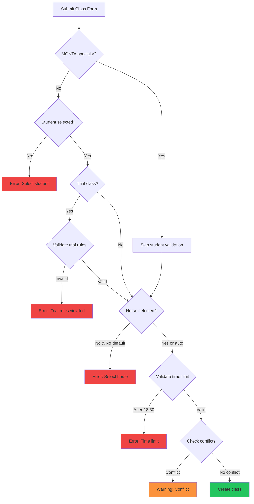

## Overview

The system enforces multiple validation rules to ensure data integrity, prevent scheduling conflicts, and maintain business logic. This guide covers all validation rules implemented in the class scheduling system.

## Time Limit Validation

### 18:30 End Time Rule

<Warning>
  **Critical Rule**: Classes cannot end after 18:30 (6:30 PM)
</Warning>

This is one of the most important validation rules in the system.

#### Examples

<CodeGroup>
```typescript Valid
// 60-minute class at 17:30 ends at 18:30 ✅
hora: "17:30"
duracion: 60
// End time: 18:30 (valid)
```

```typescript Valid
// 30-minute class at 18:00 ends at 18:30 ✅
hora: "18:00"
duracion: 30
// End time: 18:30 (valid)
```

```typescript Invalid
// 60-minute class at 18:00 ends at 19:00 ❌
hora: "18:00"
duracion: 60
// End time: 19:00 (INVALID)
```
</CodeGroup>

#### Implementation

```tsx validacionesClases.ts
export function validarHorarioLimite(
  hora: string,
  duracion: number,
): { esValido: boolean; mensaje: string } {
  const [horas, minutos] = hora.split(":").map(Number);
  const minutosInicio = horas * 60 + minutos;
  const minutosFin = minutosInicio + duracion;
  const LIMITE_MINUTOS = 18 * 60 + 30; // 18:30

  if (minutosFin > LIMITE_MINUTOS) {
    const horaFin = Math.floor(minutosFin / 60);
    const minFin = minutosFin % 60;
    return {
      esValido: false,
      mensaje: `La clase no puede terminar después de las 18:30. Con duración de ${duracion} minutos a las ${hora} terminaría a las ${horaFin}:${minFin.toString().padStart(2, "0")}.`,
    };
  }

  return { esValido: true, mensaje: "" };
}
```

#### Error Message

From the README:
> **Mensaje de error**: 
> "La clase no puede terminar después de las 18:30. Con duración de 60 minutos a las 18:00 terminaría a las 19:00."

See: `~/workspace/source/README.md:202-203`

#### Form Validation

```tsx ClaseForm.tsx
const { esValido: horarioOk, mensaje: mensajeHorario } =
  validarHorarioLimite(hora, duracion);
if (!horarioOk) {
  toast.error(mensajeHorario);
  return;
}
```

See: `~/workspace/source/src/components/forms/ClaseForm.tsx:237-242`

## Trial Class Validations

### Rule 1: No Existing Classes

<Warning>
  Students **cannot** have a trial class if they already have classes (scheduled or completed) in that specialty.
</Warning>

From the README:
> ✅ **Regla 1**: Un alumno NO puede tener clase de prueba si ya tiene clases (programadas o completadas) de esa especialidad

See: `~/workspace/source/README.md:175`

### Rule 2: No Duplicate Trials

<Warning>
  Students **cannot** repeat trial classes for the same specialty.
</Warning>

From the README:
> ✅ **Regla 2**: Un alumno NO puede repetir clase de prueba de la misma especialidad

See: `~/workspace/source/README.md:177`

### Rule 3: Quota Exemption

<Info>
  Trial classes **do not** count toward the student's monthly class quota.
</Info>

From the README:
> ✅ **Regla 3**: Las clases de prueba NO cuentan para la cuota mensual del alumno

See: `~/workspace/source/README.md:179`

### Implementation

```tsx ClaseForm.tsx
if (
  !clase &&
  esPruebaChecked &&
  tipoPrueba === "alumno_existente" &&
  alumno
) {
  const { esValido, mensaje } = validarClasePrueba(
    clases,
    alumno,
    especialidad as Clase["especialidad"],
    clase?.id,
  );
  if (!esValido) {
    toast.error(mensaje);
    return;
  }
}
```

See: `~/workspace/source/src/components/forms/ClaseForm.tsx:200-216`

## Edit Restriction Validations

### Finalized Class Rule

<Warning>
  Classes in COMPLETADA, INICIADA, or CANCELADA states **cannot** be edited or deleted.
</Warning>

From the README:
> **No se pueden editar clases con estado**:
> - COMPLETADA
> - INICIADA
> - CANCELADA
>
> **Razón**: Las clases finalizadas son registro histórico

See: `~/workspace/source/README.md:222-227`

#### Implementation

```typescript validacionesClases.ts
export function puedeEditarClase(clase: Clase): boolean {
  const estadosNoEditables: EstadoClase[] = [
    "COMPLETADA",
    "INICIADA",
    "CANCELADA",
  ];
  return !estadosNoEditables.includes(clase.estado);
}
```

#### UI Indicators

```tsx Clases.tsx
<DropdownMenuItem
  onClick={(e) => {
    e.stopPropagation();
    openEdit(row);
  }}
  disabled={!puedeEditar}
>
  <Pencil className="mr-2 h-4 w-4" />
  <div className="flex flex-col">
    <span>Editar</span>
    {!puedeEditar && (
      <span className="text-xs text-muted-foreground">
        Clase finalizada
      </span>
    )}
  </div>
</DropdownMenuItem>
```

See: `~/workspace/source/src/pages/Clases.tsx:416-432`

<Note>
  Disabled buttons show tooltips explaining why editing is not allowed: "No se puede editar una clase finalizada"
</Note>

## Private Horse Validation

### Owner-Only Rule

<Warning>
  Private horses can **only** be used by their owners.
</Warning>

From the README:
> **5. Caballos Privados**: Solo pueden ser usados por sus propietarios

See: `~/workspace/source/README.md:542`

While the exact validation code isn't shown in the files, this business rule is enforced in the class creation logic.

## Schedule Conflict Validation

### Conflict Detection

The system checks for scheduling conflicts:

<AccordionGroup>
  <Accordion title="Horse Conflicts">
    Validates that the selected horse doesn't have another class at the same time.
  </Accordion>
  
  <Accordion title="Instructor Conflicts">
    Validates that the selected instructor doesn't have another class at the same time.
  </Accordion>
</AccordionGroup>

From the README:
> **3. Validación de Conflictos de Horario**
>
> **Verifica**:
> - Que el caballo no tenga otra clase a la misma hora
> - Que el instructor no tenga otra clase a la misma hora
> - Muestra indicadores visuales (⚠️) en celdas con conflicto

See: `~/workspace/source/README.md:215-219`

<Info>
  Conflicts are shown with ⚠️ warning indicators in the calendar view.
</Info>

## Required Field Validations

### Student Selection

```tsx ClaseForm.tsx
// Caso normal: alumno existente
if (!alumnoId) {
  toast.error("Debe seleccionar un alumno");
  return;
}
alumnoIdFinal = Number(alumnoId);
```

See: `~/workspace/source/src/components/forms/ClaseForm.tsx:188-192`

<Note>
  Student selection is required for all classes except MONTA specialty.
</Note>

### Horse Selection

```tsx ClaseForm.tsx
if (caballoId) {
  // Caballo seleccionado manualmente
  caballoIdFinal = Number(caballoId);
} else if (alumno?.caballoPropio) {
  // Auto-asignar caballo del alumno
  caballoIdFinal =
    typeof alumno.caballoPropio === "object"
      ? alumno.caballoPropio.id
      : alumno.caballoPropio;
} else {
  // No hay caballo seleccionado ni predeterminado
  toast.error("Debe seleccionar un caballo");
  return;
}
```

See: `~/workspace/source/src/components/forms/ClaseForm.tsx:219-234`

### Trial Class Name Validation

```tsx ClaseForm.tsx
if (esPruebaChecked && tipoPrueba === "persona_nueva") {
  if (!nombrePrueba.trim() || !apellidoPrueba.trim()) {
    toast.error("Ingresá nombre y apellido de la persona de prueba");
    return;
  }
}
```

See: `~/workspace/source/src/components/forms/ClaseForm.tsx:168-173`

## Business Rule Summary

From the README:
> ### ✅ Validaciones Críticas:
>
> 1. **Horario**: Clases no pueden terminar después de las 18:30
> 2. **DNI**: No se permiten DNI duplicados (alumnos e instructores)
> 3. **Edición**: No se pueden editar clases finalizadas (COMPLETADA, INICIADA, CANCELADA)
> 4. **Clases de Prueba**: 
>    - Solo para alumnos inactivos
>    - No se pueden repetir en la misma especialidad
>    - No se permiten si el alumno ya tiene clases de esa especialidad
> 5. **Caballos Privados**: Solo pueden ser usados por sus propietarios
> 6. **Conflictos**: No se permite programar dos clases simultáneas con el mismo caballo o instructor

See: `~/workspace/source/README.md:533-543`

## System Limits

From the README:
> ### 📊 Límites del Sistema:
>
> - **Horario de clases**: 09:00 a 18:30
> - **Franjas horarias**: 30 minutos
> - **Planes disponibles**: 4, 8, 12, 16 clases mensuales
> - **Duraciones de clase**: 30 o 60 minutos
> - **Colores de instructor**: 7 colores predefinidos

See: `~/workspace/source/README.md:555-561`

## Validation Flow Diagram



## Validation Messages

All validation errors are displayed using toast notifications:

<CodeGroup>
```typescript Error Toast
toast.error("La clase no puede terminar después de las 18:30...");
```

```typescript Success Toast
toast.success("Clase creada correctamente");
```

```typescript Warning Toast
toast.warning("Conflicto de horario detectado");
```
</CodeGroup>

## Best Practices

<Steps>
  <Step title="Validate Early">
    Client-side validations catch errors before API calls, improving user experience
  </Step>
  
  <Step title="Clear Messages">
    Validation messages clearly explain what went wrong and how to fix it
  </Step>
  
  <Step title="Visual Indicators">
    Disabled buttons and tooltips prevent invalid actions before they occur
  </Step>
  
  <Step title="Preserve Data">
    Failed validations don't clear the form, allowing users to correct errors
  </Step>
</Steps>

## Next Steps

<CardGroup cols={2}>
  <Card title="Creating Classes" icon="calendar-plus" href="/guides/classes/creating-classes">
    Learn how to create classes with proper validation
  </Card>
  <Card title="Class States" icon="traffic-light" href="/guides/classes/class-states">
    Understand which states allow editing
  </Card>
  <Card title="Trial Classes" icon="graduation-cap" href="/guides/classes/trial-classes">
    Review trial class validation rules
  </Card>
</CardGroup>