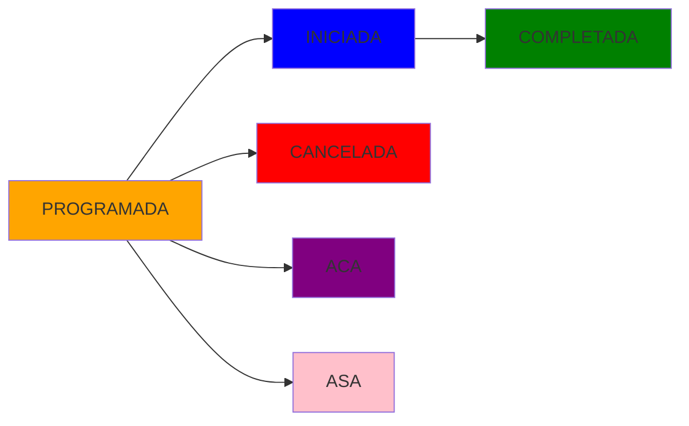

## Overview

The `EstadoClase` enumeration defines all possible states a class can be in throughout its lifecycle, from scheduling to completion or cancellation.

## Type Definition

```typescript
export type EstadoClase =
  | "PROGRAMADA"
  | "INICIADA"
  | "COMPLETADA"
  | "CANCELADA"
  | "ACA"
  | "ASA";
```

## Values

### PROGRAMADA

**Meaning**: Scheduled, pending to be held

**Visual Indicator**: 🟠 Orange border

**Description**: Default state for newly created classes. The class is scheduled but hasn't started yet.

**Characteristics**:
- Can be edited
- Can be deleted
- Can be rescheduled
- Counts toward student's monthly quota

---

### INICIADA

**Meaning**: Class in progress

**Visual Indicator**: 🔵 Blue border

**Description**: The class has started and is currently being taught.

**Characteristics**:
- **Cannot be edited** (historical record)
- **Cannot be deleted**
- Locked from modifications
- Counts toward student's monthly quota

---

### COMPLETADA

**Meaning**: Class finished successfully

**Visual Indicator**: 🟢 Green border

**Description**: The class was successfully completed by the student.

**Characteristics**:
- **Cannot be edited** (historical record)
- **Cannot be deleted**
- Locked from modifications
- Counts toward student's monthly quota
- Used in attendance statistics

---

### CANCELADA

**Meaning**: Class cancelled

**Visual Indicator**: 🔴 Red border

**Description**: The class was cancelled and did not take place.

**Characteristics**:
- **Cannot be edited** (historical record)
- **Cannot be deleted**
- Does not count toward student's monthly quota
- Can be set via "Cancel Full Day" feature
- Can include cancellation reason in observations

**Cancellation Reasons**:
- Rain
- Holiday
- Maintenance
- Special Event
- Emergency
- Other (custom)

---

### ACA (Ausencia Con Aviso)

**Meaning**: Absence with notice

**Visual Indicator**: 🟣 Purple border

**Description**: The student notified in advance that they would not attend the class.

**Characteristics**:
- **Cannot be edited** (historical record)
- **Cannot be deleted**
- Student provided advance notice
- May not count toward quota (policy dependent)
- Better for student records than ASA

---

### ASA (Ausencia Sin Aviso)

**Meaning**: Absence without notice

**Visual Indicator**: 🌸 Pink border

**Description**: The student did not show up and did not provide advance notice.

**Characteristics**:
- **Cannot be edited** (historical record)
- **Cannot be deleted**
- No advance notice was given
- Counts as used class quota
- Tracked in student attendance metrics

---

## State Transitions



**Typical Flow**:
1. Class created → `PROGRAMADA`
2. Class starts → `INICIADA`
3. Class finishes → `COMPLETADA`

**Alternative Flows**:
- Class cancelled before starting → `PROGRAMADA` → `CANCELADA`
- Student notifies absence → `PROGRAMADA` → `ACA`
- Student no-show → `PROGRAMADA` → `ASA`

## Edit Restrictions

### Editable States
- ✅ `PROGRAMADA` - Can be fully edited or deleted

### Non-Editable States
- ❌ `INICIADA` - Locked (class in progress)
- ❌ `COMPLETADA` - Locked (historical record)
- ❌ `CANCELADA` - Locked (historical record)
- ❌ `ACA` - Locked (historical record)
- ❌ `ASA` - Locked (historical record)

**Reason**: Once a class moves beyond `PROGRAMADA`, it becomes part of the historical record and cannot be modified to maintain data integrity for reporting and statistics.

## Calendar Visualization

In the calendar interface:

- Each class displays a **colored left border** indicating its state
- The class cell **background** shows the instructor's color (lightened)
- **Hover tooltips** show the full state name
- **Legends** explain the color coding

## Usage in Reports

Class states are used in various reports:

- **Attendance Rate**: `COMPLETADA` vs total scheduled
- **Cancellation Rate**: `CANCELADA` / total
- **No-show Rate**: `ASA` / total
- **Compliance Rate**: `ACA` vs `ASA` ratio
- **Class Completion**: Used to track instructor and student metrics

## API Operations

### Change State

```typescript
PATCH /clases/{id}/estado
{
  "estado": "COMPLETADA",
  "observaciones": "Optional notes"
}
```

### Bulk Cancellation

When using "Cancel Full Day" feature:
- Only classes in `PROGRAMADA` state are affected
- Classes already in other states remain unchanged
- Cancellation reason is recorded in observations

## Related

- [Class Model](/reference/models/class)
- [Validation Rules](/reference/rules/validation-rules)
- [Business Logic](/reference/rules/business-logic)